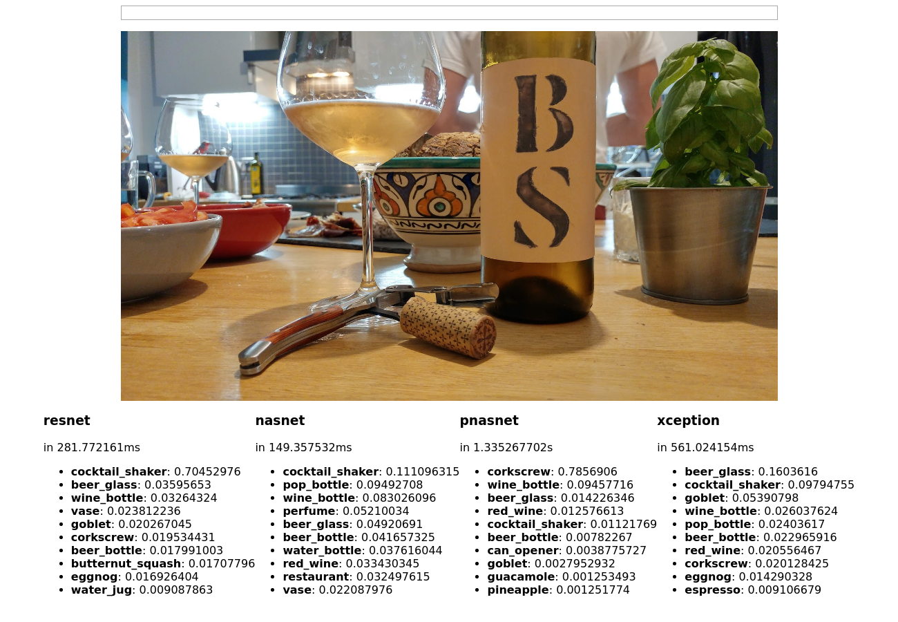
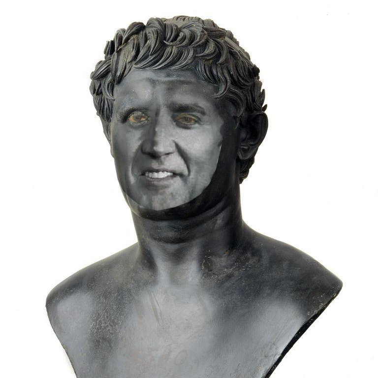
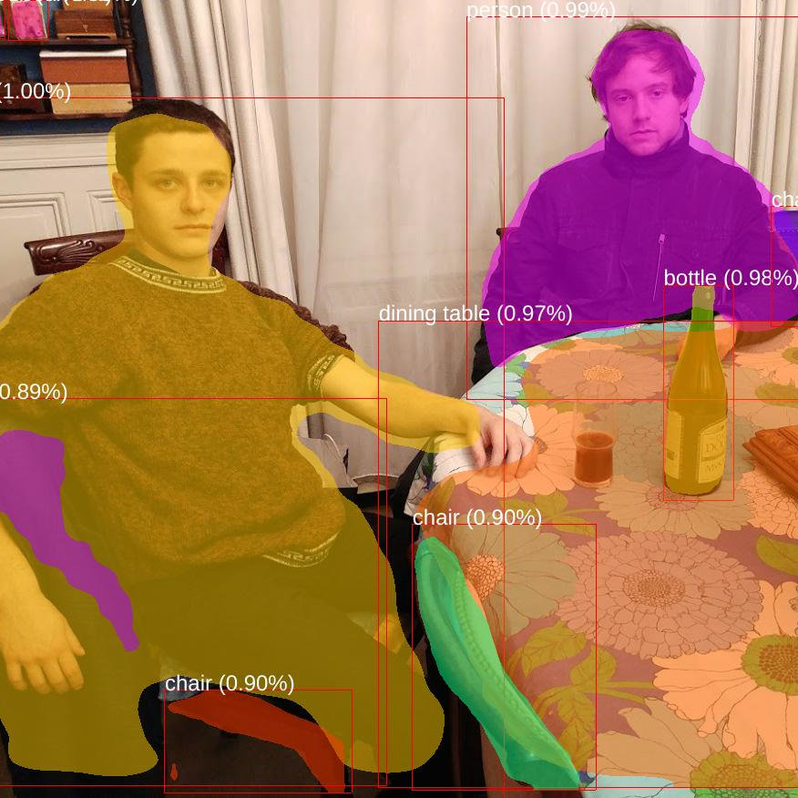

# gildas-ai 

[](https://godoc.org/github.com/gildasch/gildas-ai)
[](https://travis-ci.org/gildasch/gildas-ai)
[](https://coveralls.io/github/GildasCh/gildas-ai?branch=master)
[](https://goreportcard.com/report/github.com/GildasCh/gildas-ai)

Easy access to AI tasks (starting with object detection) as a web
interface, a JSON API and the command line.








With Tensorflow and the Go bindings installed, run it with:

```
go run cmd/gildas-ai/main.go web
```

Using Docker:

```
docker run -p 8080:8080 gildasch/gildas-ai
```

With Tensorflow and the Go bindings installed, run the example:

```
$ go run examples/classification.go pictures/objects/BrahmaBullFeria09.JPG
2019-02-02 15:59:02.660915: I tensorflow/cc/saved_model/reader.cc:31] Reading SavedModel from: ./models/tfhub_imagenet_pnasnet_large_classification/pnasnet_tf_1.8.0
2019-02-02 15:59:02.736106: I tensorflow/cc/saved_model/reader.cc:54] Reading meta graph with tags { myTag }
2019-02-02 15:59:02.820830: I tensorflow/core/platform/cpu_feature_guard.cc:141] Your CPU supports instructions that this TensorFlow binary was not compiled to use: SSE4.1 SSE4.2 AVX AVX2 FMA
2019-02-02 15:59:04.324800: I tensorflow/cc/saved_model/loader.cc:162] Restoring SavedModel bundle.
2019-02-02 15:59:04.940743: I tensorflow/cc/saved_model/loader.cc:138] Running MainOp with key legacy_init_op on SavedModel bundle.
2019-02-02 15:59:04.940778: I tensorflow/cc/saved_model/loader.cc:259] SavedModel load for tags { myTag }; Status: success. Took 2279873 microseconds.
[{pnasnet_tf_1.8.0 0.8123116 oxcart} {pnasnet_tf_1.8.0 0.07762623 ox} {pnasnet_tf_1.8.0 0.0015942967 water_buffalo} {pnasnet_tf_1.8.0 0.0011714806 plow} {pnasnet_tf_1.8.0 0.0009417561 horse_cart} {pnasnet_tf_1.8.0 0.00047737645 amphibian} {pnasnet_tf_1.8.0 0.0003411291 jinrikisha} {pnasnet_tf_1.8.0 0.00033297544 Siamese_cat} {pnasnet_tf_1.8.0 0.00033248836 garbage_truck} {pnasnet_tf_1.8.0 0.0003175597 scabbard}]
```

Models used for object detection on ImageNet:

- Keras Xception from https://modeldepot.io/harshsikka/keras-xception
- Keras ResNet50 from https://modeldepot.io/tonyshih/keras-resnet50
- Keras NASNet Mobile from https://modeldepot.io/jbrandowski/nasnet-mobile
- Tensorflow Hub PNASNet-5 (large) from https://tfhub.dev/google/imagenet/pnasnet_large/classification/2

Models used for face detection and recognition:

- face-api.js from https://itnext.io/face-api-js-javascript-api-for-face-recognition-in-the-browser-with-tensorflow-js-bcc2a6c4cf07 / https://github.com/justadudewhohacks/face-api.js

Model used for object detection and segmentation on COCO:

- Keras Mask R-CNN from https://modeldepot.io/dani/mask-r-cnn
