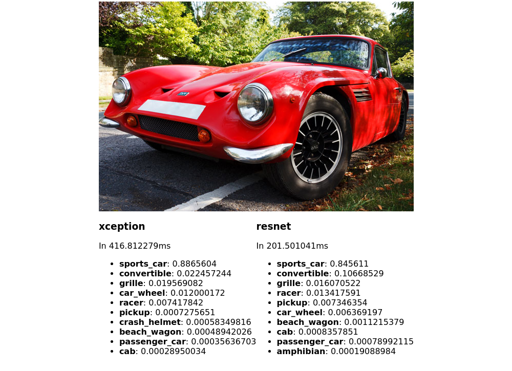

# gildas-ai

Easy access to AI tasks (starting with object detection) as a web
interface, a JSON API and the command line.




With Tensorflow and the Go bindings installed, run it with:

```
go run main.go web
```

Using Docker:

```
docker build . -t gildas-ai
docker run -p 8080:8080 gildas-ai
```

Models used for object detection on ImageNet:

- Keras Xception from https://modeldepot.io/harshsikka/keras-xception
- Keras ResNet50 from https://modeldepot.io/tonyshih/keras-resnet50
- Keras NASNet Mobile from https://modeldepot.io/jbrandowski/nasnet-mobile

Models used for face detection and recognition:

- face-api.js from https://itnext.io/face-api-js-javascript-api-for-face-recognition-in-the-browser-with-tensorflow-js-bcc2a6c4cf07 / https://github.com/justadudewhohacks/face-api.js
